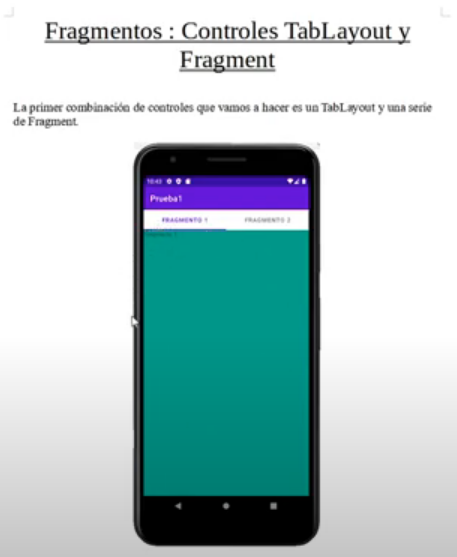

# Example using Fragments and TabLayout

## This example show how to use Fragments and TabLayout

 

```
Date: 1-11-2022
Android Version Min: 5
Android Studio Version: Android Studio Dolphin | 2021.3.1
Android Studio Dolphin | 2021.3.1
Build #AI-213.7172.25.2113.9014738, built on August 31, 2022
Runtime version: 11.0.13+0-b1751.21-8125866 x86_64
VM: OpenJDK 64-Bit Server VM by JetBrains s.r.o.
macOS 10.15.7
GC: G1 Young Generation, G1 Old Generation
Memory: 2048M
Cores: 4
Registry:
    external.system.auto.import.disabled=true
    ide.text.editor.with.preview.show.floating.toolbar=false

Non-Bundled Plugins:
    dev.polek.adbwifi (1.2.4)
    com.thoughtworks.gauge (213.5744.125)

```
##  *[Back to Android index][1]*
https://github.com/luisreylara/android


[1]: https://github.com/luisreylara/android
